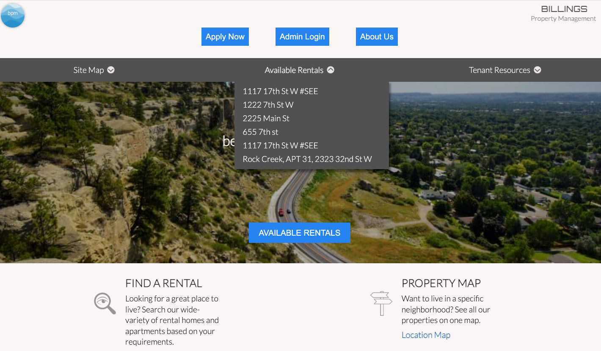

# **Billings Property Management**

This site was created for demonstrational purposes only and is not intended for financial gain. Original design credit: https://www.rentinmissoula.com/. The code-base is entirely original. Any design changes made were due to personal preference.

<br />

[](https://github.com/prettier/prettier)

<br />

 ## ☘️  **To run in local development:**
 ```js
npm i
npm start
 ```

 <br />

 ## ☘️  **Stack:**
 - EJS
 - CSS
 - JS
 - Node.js
 - MongoDB

 <br />

 ## ☘️  **Technologies:**
 - Google maps API
 - Random User  API
 - Mongoose
 - Express Router
 - GIMP

 <br />

<!--  -->
## 	☘️  **Schematic:**
</img><br>

<br />

## 	☘️  **Features:**

### **1) Custom Dropdown Menus**
A smooth-scrolling dropdown effect was done by positioning containers absolutely, with their bottoms aligned with the banner's bottom. Z-index is used to hide them and a CSS transition completes the effect. <br />
    [*View Component*](https://github.com/RobinScavo/Property-Management/blob/master/views/partials/dropdown.ejs)

<br />
</img><br>
<br />

### **2) Custom Forms and Modals**
Customers can send contact forms, repair requests and report concerns and the information is emailed to the operator using NPM nodemailer.<br />
    [*View Component*](https://github.com/RobinScavo/Property-Management/blob/master/public/js/sendForm.js)

<br />
</img><br>
<br />

### **3) Content Management**
Log in as the administrator to edit or remove current listings or create new ones in the Mongo Atlas database.<br />
    [*View Component*](https://github.com/RobinScavo/Property-Management/blob/master/public/js/admin.js)

<br />
</img><br>
<br />

## 	☘️  **Acknowledgements:**
- Thank you to the opensource contributers of NPM.
- Thank you free-use contributors of [*The Noun Project*](https://thenounproject.com/) for the images and icons. (Individual credits can be found in the alt tags).
- Thank you to the open source developers who made the image editor [*Gimp*](https://gimp.org).
- Schematic made with [*Excalidraw*](https://excalidraw.com)
